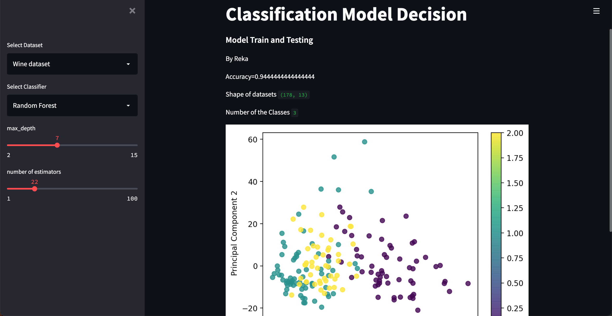

#### Create the course environment

```
conda env create
```

wait for the environment to create.

#### Activate the environment (Mac/Linux)
```
conda activate reka-streamlit
```

#### Activate the environment (Windows)
```
conda activate reka-streamlit
```

Check that your prompt changed to

```
(reka-streamlit) $
```


```
conda deactivate
```

- deactivate the environment (Windows 10):

```
deactivate reka-streamlit
```

- delete the environment:

```
conda remove -y -n reka-streamlit --all
```

- restart from environment creation and make sure that each steps completes till the end# Streamlit_ML
